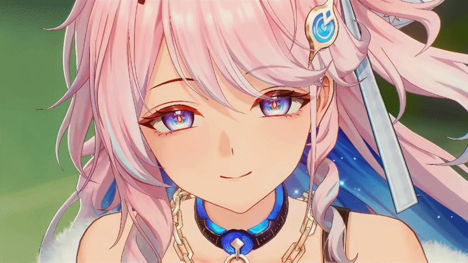

<!-- FULL WIDTH ANIMATED BANNER (denia.gif) -->

  

<!-- ANIMATED TYPOGRAPHY HEADER -->

  

<!-- TENTANG SAYA -->
<h2 align="center">T E N T A N G &nbsp; S A Y A</h2>

  <b>Profesional Otomatisasi & Tata Kelola Perkantoran</b> yang berdedikasi terhadap efisiensi operasional dan sistem manajerial yang terstruktur. 
  Memiliki keahlian mendalam dalam <b>arsitektur kearsipan digital</b>, <b>korespondensi bisnis</b>, <b>manajemen basis data</b>, serta <b>alur operasional logistik tingkat lanjut</b>.  
  <i>Lebih dari sekadar administrator, saya memiliki antusiasme besar pada rekayasa perangkat lunak dan otomasi teknologi. Saya memadukan logika komputasi modern dengan kebutuhan operasional bisnis untuk menciptakan ekosistem kerja yang lebih cerdas, cepat, dan produktif.</i>

  

<!-- SOCIALS -->
<h2 align="center">M A R I &nbsp; T E R H U B U N G</h2>

  
  
  
  
  
  
  
  
  
  

  

<!-- TECH STACK -->
<h2 align="center">T E K N O L O G I &nbsp; & &nbsp; P E R A L A T A N</h2>

<h3 align="center">Frontend & Core Programming</h3>

  
  
  
  
  
  
  
  
  
  

<h3 align="center">Backend & Cloud Infrastructure</h3>

  
  
  
  
  
  
  
  
  
  
  
  
  
  

<h3 align="center">Office, Tools & Creative Engines</h3>

  
  
  
  
  
  
  
  
  
  
  

  

<!-- SNAKE GAME -->
<h2 align="center">K O N T R I B U S I &nbsp; G I T H U B</h2>

  

  

<!-- RINGKASAN KONTRIBUSI -->
<h2 align="center">R I N G K A S A N &nbsp; K O N T R I B U S I</h2>

  

  

  

<!-- STATISTIK AKTIVITAS -->
<h2 align="center">S T A T I S T I K &nbsp; A K T I V I T A S</h2>

  

  

 

  

  

<!-- DUKUNGAN -->
<h2 align="center">D U K U N G A N</h2>

  
  
  

 

  <b>Synchronized with precision • Styled with Denia's Pink Aesthetic (#F29FB0)</b>

